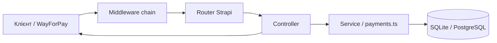

# Організація API та обробка HTTP-запитів

> **Оновлення:** backend переписано на Express + Sequelize. Актуальна архітектура: [architecture.md](./architecture.md), [api.md](./api.md). Нижче — опис **legacy Strapi 5** (див. `legacy/strapi/`).

Документ описує, як у попередній версії проєкту **rok-m-backend** (Strapi 5) були влаштовані REST API, маршрути, middleware і обробка запитів.

Пов’язані матеріали:

- [FRONTEND_AUTH_API.md](./FRONTEND_AUTH_API.md) — ендпоінти та приклади для фронтенду
- [FRONTEND_PRICING_API.md](./FRONTEND_PRICING_API.md) — ціни
- [DATABASE_DESIGN_UA.md](./DATABASE_DESIGN_UA.md) — моделі даних

---

## 1. Загальна архітектура

Backend — **headless CMS Strapi 5** з REST API. Усі публічні ендпоінти для клієнта мають префікс:

```text
http://<host>:1337/api/...
```

Організація коду за **API-модулями** у `src/api/<module-name>/`:

```text
src/api/<module>/
├── content-types/     # схеми (опційно)
├── controllers/       # обробники HTTP
├── routes/            # маршрути → handler
└── services/          # бізнес-логіка (опційно)
```

Додатково:

- `src/middlewares/` — глобальні middleware (наприклад WayForPay)
- `src/extensions/` — розширення плагінів (users-permissions)
- `src/index.ts` — `bootstrap`, lifecycle-підписки на БД
- `config/middlewares.ts`, `config/api.ts`, `config/server.ts` — інфраструктура HTTP



---

## 2. Два типи маршрутів

### 2.1. Автогенеровані (Content API)

Для content types з `factories.createCoreRouter` Strapi створює стандартні CRUD:

| Модуль | Файл | Приклади URL |
|--------|------|----------------|
| method-section | `src/api/method-section/routes/method-section.ts` | `GET /api/method-sections`, `GET /api/method-sections/:id` |
| method | `src/api/method/routes/method.ts` | `GET /api/methods`, `GET /api/methods/:id` |
| feedback | (core router) | `POST /api/feedbacks` — також дубльовано кастомним `/api/feedback` |
| pricing | `src/api/pricing/routes/pricing.ts` | `GET /api/pricing` (single type) |
| user-method-section | core + custom | CRUD у адмінці; клієнт — кастомні `/assign`, `/me` |

Доступ керується **Users & Permissions** (ролі Public / Authenticated) в адмінці Strapi.

Налаштування пагінації REST: `config/api.ts` (`defaultLimit: 25`, `maxLimit: 100`).

### 2.2. Кастомні (власні шляхи)

Оголошуються вручну в `routes/*.ts` — `method`, `path`, `handler`, `config`.

| Файл маршрутів | Префікс шляхів | Призначення |
|----------------|----------------|-------------|
| `src/api/auth-code/routes/01-auth-code.ts` | `/auth/*`, `/feedback`, `/mak-cards/*` | Реєстрація, профіль, пароль, МАК, feedback |
| `src/api/payments/routes/payments.ts` | `/payments/*` | WayForPay callback, статус оплати |
| `src/api/tariffs/routes/tariffs.ts` | `/tariffs/*/activate` | Ініціалізація оплати тарифів |
| `src/api/user-method-section/routes/user-method-section.ts` | `/user-method-sections/*` | Оплата розділу, «мої методики» |

Префікс `01-` у імені файлу задає порядок завантаження маршрутів (auth-code реєструється перед placeholder).

**Стандартний логін Strapi** (не кастомний модуль):

```http
POST /api/auth/local
```

— ендпоінт плагіна **users-permissions**.

---

## 3. Ланцюжок middleware

Порядок у `config/middlewares.ts`:

| № | Middleware | Роль |
|---|------------|------|
| 1 | `global::wayforpay-callback-raw-body` | Буферизація сирого тіла для callback WayForPay |
| 2 | `strapi::errors` | Обробка помилок |
| 3 | `strapi::cors` | CORS для фронтенду |
| 4 | `strapi::security` | Заголовки безпеки |
| 5 | `strapi::logger` | Логування |
| 6 | `strapi::query` | Парсинг query (`filters`, `populate`) |
| 7 | `strapi::body` | Парсинг JSON / form body |
| 8 | `strapi::session` | Сесії |
| 9 | `strapi::public` | Статика |

### CORS

Дозволені origin (якщо не задано `CORS_ORIGINS` у `.env`):

- `http://localhost:3000`, `http://localhost:5173`
- `https://www.rok-mentalhealth.com`, `https://rok-mentalhealth.com`

Кілька origin через кому: `CORS_ORIGINS=http://localhost:3000,https://example.com`.

Дозволені методи: `GET`, `POST`, `PUT`, `PATCH`, `DELETE`, `OPTIONS`.  
Заголовки: `Content-Type`, `Authorization`, `Origin`, `Accept`.

### WayForPay: сире тіло запиту

Файл: `src/middlewares/wayforpay-callback-raw-body.ts`

Для `POST .../payments/wayforpay-callback` middleware:

1. Читає **повне** тіло запиту в буфер (до `strapi::body`).
2. Зберігає рядок у `ctx.state.wayforpayRawBody`.
3. Відновлює stream для наступних middleware.

Це потрібно, бо WayForPay інколи надсилає `application/x-www-form-urlencoded`, де JSON — у значенні поля; стандартний парсер може обрізати або неправильно розібрати payload.

Контролер об’єднує `ctx.request.body` і розбір `wayforpayRawBody` (`src/api/payments/controllers/payments.ts`).

---

## 4. Обробка одного HTTP-запиту

Типовий потік для **кастомного** ендпоінта:

```text
1. Middleware (CORS, body, …)
2. Router → handler "module.action"
3. Controller:
   - (опційно) ensureUserFromJwt(ctx)
   - валідація ctx.request.body / query
   - виклик service або entityService / knex
   - ctx.body = … або return ctx.badRequest / unauthorized
4. Strapi серіалізує відповідь у JSON
```

### Koa context (`ctx`)

Контролери Strapi використовують **Koa**-контекст:

| Об’єкт | Використання |
|--------|----------------|
| `ctx.request.body` | Тіло POST/PUT (JSON) |
| `ctx.request.query` | Query-параметри (`?orderReference=...`) |
| `ctx.request.headers` | `Authorization`, `Content-Type` |
| `ctx.state.user` | Користувач після JWT (ручна або Strapi-перевірка) |
| `ctx.body` | Тіло відповіді |
| `ctx.badRequest(msg)` | HTTP 400 |
| `ctx.unauthorized()` | HTTP 401 |
| `ctx.notFound(msg)` | HTTP 404 |
| `ctx.send(data)` | Відповідь з коректним статусом |

---

## 5. Автентифікація та авторизація

### 5.1. Два підходи

| Підхід | Де | Як |
|--------|-----|-----|
| Strapi JWT (стандарт) | `POST /api/auth/local` | Клієнт отримує JWT, далі `Authorization: Bearer …` |
| Ручна перевірка JWT | Більшість кастомних routes | `config: { auth: false }` + `ensureUserFromJwt` у контролері |

### 5.2. Чому `auth: false` на захищених маршрутах

У Strapi 5 вмикнення `auth: true` на кастомному route проходить через **content-api permissions** і часто дає **403**, навіть з валідним JWT.

Тому для `/auth/me`, `/tariffs/*/activate`, `/user-method-sections/*`, `/mak-cards/*` у маршрутах стоїть `auth: false`, а перевірка виконується в коді:

```ts
// src/api/auth-code/controllers/auth-code.ts
async ensureUserFromJwt(ctx) {
  if (ctx.state.user) return;
  const jwtService = strapi.plugin('users-permissions').service('jwt');
  const payload = await jwtService.getToken(ctx);
  if (payload?.id == null) return;
  const user = await userService.fetchAuthenticatedUser(Number(payload.id));
  if (user) ctx.state.user = user;
}
```

Після цього контролер перевіряє `if (!ctx.state.user) return ctx.unauthorized()`.

Інші модулі **перевикористовують** той самий метод:

```ts
const authCodeController = strapi.controller('api::auth-code.auth-code');
await authCodeController.ensureUserFromJwt(ctx);
```

### 5.3. Публічні ендпоінти

Без JWT: реєстрація, скидання пароля, feedback, WayForPay callback, `GET /payments/status`, читання method-sections/methods/pricing (за правами Public у адмінці).

---

## 6. Групи API (логіка)

### Auth та профіль (`api::auth-code`)

| Method | Path | Handler | Auth |
|--------|------|---------|------|
| POST | `/api/auth/register` | register | ні |
| POST | `/api/auth/password/request-code` | requestPasswordCode | ні |
| POST | `/api/auth/password/reset` | resetPassword | ні |
| GET | `/api/auth/me` | me | JWT (ручний) |
| PUT/POST | `/api/auth/profile` | updateMe | JWT (ручний) |
| POST | `/api/feedback` | sendFeedback | ні |
| GET/PUT/POST | `/api/mak-cards/favorites*` | favorites | JWT (ручний) |
| POST | `/api/mak-cards/access` | grantMakCardsAccess | JWT (ручний) |

Бізнес-логіка: валідація полів, хешування кодів (SHA-256), email (Brevo / SendGrid), створення користувача через `strapi.query('plugin::users-permissions.user')`.

### Контент (автогенерований CRUD)

- `GET /api/method-sections` — список розділів
- `GET /api/method-sections?filters[slug][$eq]=...&populate=methods`
- `GET /api/methods?filters[slug][$eq]=...&populate=method_section`

Query-параметри Strapi: `filters`, `populate`, `pagination`, `fields`, `sort`.

### Ціни

- `GET /api/pricing` — single type (див. [FRONTEND_PRICING_API.md](./FRONTEND_PRICING_API.md))

### Платежі (`api::payments`)

| Method | Path | Опис |
|--------|------|------|
| POST | `/api/payments/wayforpay-callback` | Webhook WayForPay → надання доступу |
| GET | `/api/payments/status?orderReference=` | Чи застосовано доступ після оплати |

Сервіс: `src/api/payments/services/payments.ts` — підпис HMAC-MD5, `createAccessPayment`, `applyPaidAccess`, ціни з `loadPricingSettings()`.

**Callback (скорочено):**

1. Зібрати payload (body + raw).
2. Перевірити `merchantSignature` (у production — обов’язково).
3. Розпарсити `orderReference` (`RKM|kind|userId|...`).
4. Звірити `amount` / `currency` з адмінкою цін.
5. При статусі Approved — `applyPaidAccess` або `applyPaidSectionAccess`.
6. Відповідь JSON для WayForPay: `{ orderReference, status: "accept", time, signature }`.

### Тарифи (`api::tariffs`)

- `POST /api/tariffs/medium/activate`
- `POST /api/tariffs/premium/activate`

→ `createAccessPayment('medium' | 'premium', user)` → `{ status: 'payment_required', paymentUrl, amount, ... }`.

### Розділи користувача (`api::user-method-section`)

- `POST /api/user-method-sections/assign` — оплата одного розділу
- `GET /api/user-method-sections/me` — список придбаних розділів + `makCardsAccess`

Розширений core controller (`factories.createCoreController` + власні actions).

---

## 7. Шар сервісів

| Сервіс | Файл | Відповідальність |
|--------|------|------------------|
| payments | `src/api/payments/services/payments.ts` | WayForPay, доступи, ціни |
| pricing (core) | `src/api/pricing/services/pricing.ts` | CRUD у адмінці |
| pricing-settings | `src/api/pricing/pricing-settings.ts` | Читання цін для payments і seed |
| auth-code | `src/api/auth-code/services/auth-code.ts` | Допоміжний (placeholder) |

Контролери **тонкі**: HTTP + валідація; важка логіка — у `payments.ts` або `entityService` / `knex`.

---

## 8. Події після змін у БД (`src/index.ts`)

У `bootstrap` підписано lifecycle на `plugin::users-permissions.user`:

- **afterCreate** — якщо при створенні виставлені прапорці тарифу в адмінці, синхронізувати доступ через `applyPaidAccess`.
- **afterUpdate** — при зміні `isPremium` / `isMedium` / `makCardsAccess` оновити доступ або відкликати methodics.

Це **не HTTP**, але частина обробки «запитів на зміну стану» з адмін-панелі Strapi.

---

## 9. Коди відповідей та помилки

| Код | Коли |
|-----|------|
| **200** | Успіх, дані в `ctx.body` |
| **400** | Невалідні параметри, підпис WayForPay, сума/валюта |
| **401** | Немає або невалідний JWT на захищеному route |
| **403** | Strapi permissions (типово для core API без Public find) |
| **404** | Сутність не знайдена (розділ методики тощо) |

Повідомлення помилок — англійською в API (`"methodSectionId is required"`), форма feedback — українською в окремих handler’ах.

---

## 10. Розширення users-permissions

`src/extensions/users-permissions/strapi-server.js`:

- Залишено `updateProfile` для сумісності.
- **`/auth/me` і `/auth/profile` навмисно не дубльуються** тут — вони в `api::auth-code`, щоб уникнути 403 від content-api.

Розширена схема User: `src/extensions/users-permissions/content-types/user/schema.json`.

---

## 11. Зведена схема URL для фронтенду

```text
/api/auth/register | /api/auth/local          → акаунт
/api/auth/me | /api/auth/profile             → профіль (JWT)
/api/method-sections | /api/methods          → контент (Public)
/api/pricing                                 → ціни (Public)
/api/tariffs/{medium|premium}/activate       → оплата тарифу (JWT)
/api/user-method-sections/assign | /me     → розділи (JWT)
/api/mak-cards/*                             → МАК (JWT)
/api/payments/status                         → статус після оплати
/api/feedback                                → форма зв’язку
```

Повна таблиця з прикладами body — у [FRONTEND_AUTH_API.md](./FRONTEND_AUTH_API.md).

---

## 12. Підсумок

- API організовано **модульно** (Strapi convention): routes → controllers → services.
- **Два шари маршрутів**: автоматичний Content API + кастомні бізнес-ендпоінти.
- HTTP обробляється через **middleware Koa/Strapi**; для WayForPay — окремий middleware сирого body.
- **JWT** на кастомних routes перевіряється вручну (`ensureUserFromJwt`), а не лише через `auth: true`.
- Платежі та доступи централізовані в **`payments` service**; контролери лише приймають HTTP і повертають JSON.
