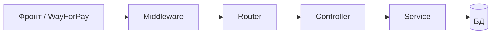
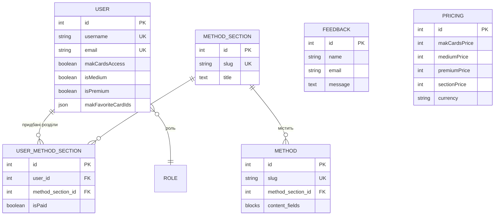

# Проєктування бази даних, моделей та API

Документ описує логічну структуру даних, моделі та організацію HTTP API backend-проєкту **rok-m-backend** (Strapi 5).

Пов’язані матеріали:

- [DATABASE_ПІДКЛЮЧЕННЯ.md](./DATABASE_ПІДКЛЮЧЕННЯ.md) — налаштування SQLite / PostgreSQL
- [FRONTEND_AUTH_API.md](./FRONTEND_AUTH_API.md) — API для фронтенду
- [FRONTEND_PRICING_API.md](./FRONTEND_PRICING_API.md) — ціни та відображення на UI
- [API_ORGANIZATION_UA.md](./API_ORGANIZATION_UA.md) — маршрути, middleware, JWT, обробка запитів

---

## 1. Технологічний рівень

| Аспект | Рішення |
|--------|---------|
| Платформа | Strapi 5 (headless CMS + REST API) |
| Доступ до БД | Query API, Entity/Document Service, за потреби Knex (`strapi.db.connection`) |
| Локально | SQLite — `.tmp/data.db` |
| Продакшен | PostgreSQL — `config/database.ts` |
| ORM | **Sequelize не використовується**; Strapi працює через Knex |

Моделі описуються декларативно в `schema.json`. Strapi автоматично створює таблиці, join-таблиці для relations і службові поля (`document_id`, `locale`, publish-стан тощо).

---

## 2. Організація API та обробка HTTP-запитів

### 2.1. Загальна схема

Усі клієнтські запити йдуть на префікс **`/api`**. Код розбитий за модулями:

```text
src/api/<module>/
├── routes/        → URL + method → handler
├── controllers/   → HTTP: валідація, ctx.body, коди помилок
├── services/      → бізнес-логіка (платежі, …)
└── content-types/ → schema.json (модель БД)
```



Детальніше (окремий файл): [API_ORGANIZATION_UA.md](./API_ORGANIZATION_UA.md).

### 2.2. Типи маршрутів

| Тип | Приклад | Джерело |
|-----|---------|---------|
| **Content API** (автогенерація) | `GET /api/method-sections`, `GET /api/pricing` | `factories.createCoreRouter` |
| **Кастомні** | `POST /api/auth/register`, `POST /api/payments/wayforpay-callback` | `routes/*.ts` вручну |
| **Плагін** | `POST /api/auth/local` | users-permissions |

Кастомні модулі та їх шляхи:

| Модуль | Основні ендпоінти |
|--------|-------------------|
| `auth-code` | `/api/auth/*`, `/api/feedback`, `/api/mak-cards/*` |
| `payments` | `/api/payments/wayforpay-callback`, `/api/payments/status` |
| `tariffs` | `/api/tariffs/medium/activate`, `.../premium/activate` |
| `user-method-section` | `/api/user-method-sections/assign`, `.../me` |

REST-пагінація: `config/api.ts` (`defaultLimit: 25`, `maxLimit: 100`). Фільтри та `populate` — стандартні query Strapi (`filters`, `populate`, `sort`).

### 2.3. Middleware (ланцюжок обробки запиту)

Порядок у `config/middlewares.ts`:

1. **`wayforpay-callback-raw-body`** — буфер повного тіла для webhook WayForPay → `ctx.state.wayforpayRawBody`
2. `strapi::errors` → `strapi::cors` → `strapi::security` → `strapi::logger`
3. `strapi::query` → `strapi::body` → `strapi::session` → `strapi::public`

**CORS:** `localhost:3000`, `localhost:5173`, `rok-mentalhealth.com` (або `CORS_ORIGINS` у `.env`).

**Типовий запит:** middleware → router → controller → service / `entityService` / Knex → JSON у `ctx.body`.

Контролери використовують **Koa `ctx`**: `ctx.request.body`, `ctx.request.query`, `ctx.badRequest()`, `ctx.unauthorized()`, `ctx.notFound()`.

### 2.4. Автентифікація (JWT)

| Підхід | Де |
|--------|-----|
| Стандартний логін | `POST /api/auth/local` → JWT |
| Кастомні захищені routes | `config: { auth: false }` + **`ensureUserFromJwt(ctx)`** у контролері |

На кастомних маршрутах `auth: true` часто дає **403** через content-api permissions, тому JWT перевіряється вручну: сервіс `users-permissions` читає `Authorization: Bearer`, завантажує користувача в `ctx.state.user`. Той самий `ensureUserFromJwt` викликають модулі `tariffs`, `user-method-section`, `mak-cards`.

Публічно без JWT: реєстрація, скидання пароля, feedback, WayForPay callback, читання контенту/цін (роль **Public** у Strapi).

### 2.5. Зв’язок API з моделями даних

| HTTP-операція | Модель / таблиці |
|---------------|------------------|
| `GET /api/method-sections`, `/api/methods` | `method_sections`, `methods` |
| `GET /api/pricing` | `pricings` (single type) |
| `GET /api/auth/me` | `up_users` + `user_method_sections` |
| `POST /api/tariffs/*/activate`, `/mak-cards/access`, `/user-method-sections/assign` | читання `pricings` → WayForPay → оновлення `up_users`, `user_method_sections` |
| `POST /api/payments/wayforpay-callback` | валідація суми з `pricings` → `applyPaidAccess` |
| `POST /api/feedback` | `feedbacks` |

Платіжні транзакції в БД **не зберігаються** — лише зміна прапорців доступу після успішного callback.

### 2.6. Обробка WayForPay callback

1. Middleware зберігає сире тіло (form-urlencoded / JSON у полі).
2. Controller збирає payload, перевіряє `merchantSignature`.
3. Парсить `orderReference` (`RKM|kind|userId|...`).
4. Звіряє `amount` і `currency` з записом **Ціни**.
5. При статусі Approved — оновлює `up_users` / `user_method_sections`.
6. Відповідь: `{ orderReference, status: "accept", time, signature }`.

Реалізація: `src/api/payments/controllers/payments.ts`, `src/api/payments/services/payments.ts`.

### 2.7. Події без HTTP (`src/index.ts`)

Lifecycle на `plugin::users-permissions.user` (**afterCreate**, **afterUpdate**): якщо в адмінці змінили прапорці тарифу — синхронізація доступу через `applyPaidAccess` / `revokeAllMethodicsAccess`.

---

## 3. Принципи проєктування даних

Предметна область розділена на чотири блоки:

1. **Контент** — розділи та методики (CMS, draft/publish).
2. **Користувач і доступ** — розширена модель `User` + зв’язок «користувач ↔ розділ».
3. **Комерція** — глобальні ціни (single type), без окремої таблиці замовлень.
4. **Сервіс** — зворотний зв’язок, коди скидання пароля в полях користувача.

**Оплати WayForPay** не зберігаються окремою сутністю `Order`. Після callback оновлюються прапорці доступу (`isMedium`, `isPremium`, `makCardsAccess`, `user_method_sections.isPaid`). Ідентифікатор `orderReference` використовується лише для валідації платежу в момент callback.

---

## 4. Логічна ER-модель



---

## 5. Прикладні сутності (content types)

### 5.1. `method_sections` — розділ методик

| Параметр | Значення |
|----------|----------|
| UID Strapi | `api::method-section.method-section` |
| Таблиця | `method_sections` |
| Тип | collectionType |
| Draft & Publish | так |

| Поле | Тип | Опис |
|------|-----|------|
| `slug` | uid | Унікальний ключ для URL (`communicate`, `kids` тощо) |
| `title` | text | Заголовок розділу |
| `subtitle` | text | Підзаголовок |
| `mobtitle` | text | Заголовок для мобільної версії |
| `methods` | relation 1:N | Методики розділу (`api::method.method`) |

**Зв’язок:** один розділ → багато методик.

Файл схеми: `src/api/method-section/content-types/method-section/schema.json`

---

### 5.2. `methods` — окрема методика

| Параметр | Значення |
|----------|----------|
| UID Strapi | `api::method.method` |
| Таблиця | `methods` |
| Тип | collectionType |
| Draft & Publish | так |

| Група | Поля |
|-------|------|
| Ідентифікація | `title`, `slug` (uid від `title`) |
| Метадані | `author_source`, `approach`, `target_audience`, `goal`, `time`, `materials` |
| Rich content | `purpose`, `therapeutic_effect`, `short_instruction`, `instruction`, `interpretation`, `completion` — тип **blocks** |
| Компонент | `reflection_questions` (repeatable) → `methods.reflection-questions` |
| Зв’язок | `method_section` — manyToOne до `method_sections` |

Контент призначений для публічного читання через API (`find`, `findOne`, `populate`).

Файл схеми: `src/api/method/content-types/method/schema.json`

---

### 5.3. `up_users` — користувач

| Параметр | Значення |
|----------|----------|
| UID Strapi | `plugin::users-permissions.user` |
| Таблиця | `up_users` |
| Тип | collectionType (плагін Users & Permissions) |
| Draft & Publish | ні |

**Стандартні поля Strapi:** `username`, `email`, `password`, `provider`, `confirmed`, `blocked`, `role`, токени скидання/підтвердження тощо.

**Додані бізнес-поля:**

| Поле | Тип | Опис |
|------|-----|------|
| `makCardsAccess` | boolean | Доступ до МАК-карток після оплати |
| `isMedium` | boolean | Тариф Medium |
| `isPremium` | boolean | Тариф Premium |
| `makFavoriteCardIds` | json | Масив id улюблених карток, напр. `["card-1", "card-3"]` |
| `userMethodSections` | relation 1:N | Придбані / прив’язані розділи |
| `emailConfirmationCode` | string (private) | Код підтвердження email |
| `emailConfirmationExpires` | datetime (private) | Термін дії коду email |
| `passwordResetCode` | string (private) | Код скидання пароля |
| `passwordResetExpires` | datetime (private) | Термін дії коду пароля |

Файл схеми: `src/extensions/users-permissions/content-types/user/schema.json`

> **Примітка реалізації:** частина оновлень (`is_medium`, `mak_cards_access`, `mak_favorite_card_ids`) виконується через **Knex** напряму в таблицю `up_users`, оскільки `strapi.query` для users-permissions інколи не зберігає кастомні колонки надійно.

---

### 5.4. `user_method_sections` — доступ користувача до розділу

| Параметр | Значення |
|----------|----------|
| UID Strapi | `api::user-method-section.user-method-section` |
| Таблиця | `user_method_sections` |
| Тип | collectionType (зв’язуюча сутність + стан оплати) |
| Draft & Publish | ні |

| Поле | Тип | Опис |
|------|-----|------|
| `user` | relation M:1 | Користувач (`plugin::users-permissions.user`) |
| `method_section` | relation M:1 | Розділ (`api::method-section.method-section`) |
| `isPaid` | boolean | Чи оплачено доступ до цього розділу (default: false) |

**Семантика:**

- При оплаті **одного розділу** (`section`) — створюється/оновлюється один запис з `isPaid = true` для конкретного `method_section`.
- При **Medium** / **Premium** — сервіс платежів масово виставляє `isPaid = true` для всіх існуючих розділів користувача.

Унікальність пари «користувач + розділ» забезпечується прикладною логікою, а не явним unique constraint у `schema.json`.

Файл схеми: `src/api/user-method-section/content-types/user-method-section/schema.json`

---

### 5.5. `pricings` — ціни (single type)

| Параметр | Значення |
|----------|----------|
| UID Strapi | `api::pricing.pricing` |
| Таблиця | `pricings` |
| Тип | **singleType** (один глобальний запис) |
| Draft & Publish | ні |

| Поле | Тип | Default | Відповідає оплаті |
|------|-----|---------|-------------------|
| `makCardsPrice` | integer | 1890 | `mak-cards` |
| `mediumPrice` | integer | 3990 | `medium` |
| `premiumPrice` | integer | 4990 | `premium` |
| `sectionPrice` | integer | 890 | `section` |
| `currency` | string (3) | UAH | WayForPay |

Редагується в адмінці: **Content Manager → Ціни**. Використовується в `src/api/payments/services/payments.ts` та через `GET /api/pricing` на фронті.

При першому старті запис створюється в `bootstrap` (`ensureDefaultPricing` у `src/index.ts`).

Файл схеми: `src/api/pricing/content-types/pricing/schema.json`

---

### 5.6. `feedbacks` — зворотний зв’язок

| Параметр | Значення |
|----------|----------|
| UID Strapi | `api::feedback.feedback` |
| Таблиця | `feedbacks` |
| Тип | collectionType |
| Draft & Publish | ні |

| Поле | Тип | Обмеження |
|------|-----|-----------|
| `name` | string | required, min 2 |
| `email` | email | required |
| `message` | text | required, min 10 |
| `tariff` | string | опційно |
| `isProcessed` | boolean | default false — для обробки в адмінці |

Не пов’язаний з `User` — анонімні звернення з форми сайту.

Файл схеми: `src/api/feedback/content-types/feedback/schema.json`

---

### 5.7. `auth_code_placeholders` — технічний placeholder

| Параметр | Значення |
|----------|----------|
| UID Strapi | `api::auth-code.placeholder` |
| Таблиця | `auth_code_placeholders` |
| Призначення | Реєстрація API-модуля `auth-code` у Strapi |

У предметній моделі **не використовується**. Логіка реєстрації, профілю та скидання пароля — у `src/api/auth-code/controllers/auth-code.ts` і полях `up_users`.

---

## 6. Компоненти (вкладені структури)

### `methods.reflection-questions`

| Параметр | Значення |
|----------|----------|
| Таблиця компонента | `components_methods_reflection_questions` |
| Поле | `text` (text) |
| Використання | repeatable у `methods.reflection_questions` |

Файл: `src/components/methods/reflection-questions.json`

Strapi зберігає компоненти в окремих таблицях, прив’язаних до запису `methods`.

---

## 7. Модель доступу (бізнес-логіка поверх БД)

```text
                    ┌─────────────────┐
                    │  pricing (1)    │  суми для WayForPay / UI
                    └────────┬────────┘
                             │
              WayForPay callback
                             ▼
┌──────────┐    ┌──────────────────────────────────────┐
│  User    │───►│ makCardsAccess / isMedium / isPremium │
└────┬─────┘    └──────────────────────────────────────┘
     │
     └──► user_method_sections[].isPaid  (по кожному розділу)
```

| Тип доступу (`AccessKind`) | Зміни в БД після успішної оплати |
|----------------------------|----------------------------------|
| `mak-cards` | `makCardsAccess = true` |
| `medium` | `isMedium = true`; усі `user_method_sections.isPaid = true` |
| `premium` | `isPremium = true`, `makCardsAccess = true`; усі розділи `isPaid = true` |
| `section` | один `user_method_section` для `methodSectionId` з `isPaid = true` |

Транзакції та історія платежів **не персистуються** — лише кінцевий стан доступу.

Реалізація: `src/api/payments/services/payments.ts`, callback: `POST /api/payments/wayforpay-callback`.

---

## 8. Зведена таблиця сутностей

| Сутність | Таблиця | Тип Strapi | Publish | Роль |
|----------|---------|------------|---------|------|
| Розділ методик | `method_sections` | collection | так | Категорія контенту |
| Методика | `methods` | collection | так | Контент |
| Користувач | `up_users` | collection (plugin) | ні | Auth + права доступу |
| Доступ до розділу | `user_method_sections` | collection | ні | Покупка / тариф |
| Ціни | `pricings` | singleType | ні | Глобальний конфіг |
| Зворотний зв’язок | `feedbacks` | collection | ні | Форма на сайті |
| Auth placeholder | `auth_code_placeholders` | collection | ні | Технічний |

---

## 9. Службові таблиці Strapi

Окремо Strapi створює системні та адмінські таблиці, наприклад:

- `admin_*` — користувачі та сесії адмін-панелі
- `up_roles`, `up_permissions` — ролі та права API
- join-таблиці для relations і publish workflow
- `strapi_*` — метадані, міграції, налаштування

Прикладний код проєкту з ними напряму не працює — доступ лише через API Strapi та плагіни.

---

## 10. Підсумок

- **БД:** реляційна схема з ядром «розділ → методика», шаром прав користувача та глобальними цінами; Knex + SQLite / PostgreSQL; без Sequelize і без таблиці замовлень.
- **Моделі:** декларативні Strapi content types + розширення User; `blocks` і components для контенту методик.
- **API:** REST під `/api`; Content API + кастомні маршрути; JWT через `ensureUserFromJwt`; WayForPay callback з middleware сирого body.
- **Експлуатація:** ціни та доступ змінюються в адмінці без redeploy; контент методик — draft/publish.
