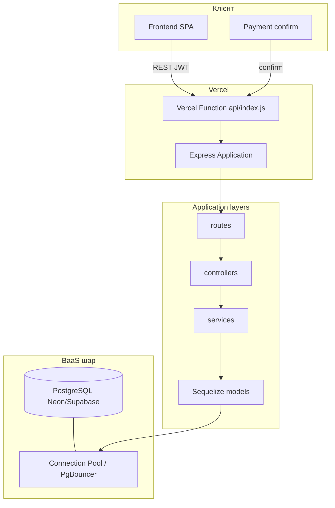

# Архітектура системи

## Мета дипломного проєкту

Сайт ROK Mental Health — **демонстраційна імплементація** дослідженої серверної архітектури, а не самоціль. Основний результат:

- обґрунтована гібридна **serverless + BaaS** модель;
- власний **API-шар** (Express) поверх керованої **PostgreSQL**;
- чітке розділення шарів (routes / controllers / services / models);
- готовність до деплою на **Vercel Functions** та масштабування read-heavy навантаження.

## Загальна схема

## Шари відповідальності

| Шар | Відповідальність |
|-----|------------------|
| **routes** | HTTP-метод, шлях, middleware (auth, validation) |
| **controllers** | Парсинг запиту, статус-код, формат відповіді |
| **services** | Бізнес-логіка, транзакції, оплати (provider-agnostic), email |
| **models** | Схема БД, associations, індекси |
| **middlewares** | JWT, ролі, помилки, валідація |

Бізнес-логіка **не** знаходиться в routes — це спрощує тестування та зміну транспорту (локальний сервер ↔ serverless).

## Гібрид BaaS + власний API

| Компонент | Роль |
|-----------|------|
| **PostgreSQL (Neon/Supabase)** | BaaS: керована БД, бекапи, pooling |
| **Express API** | Повний контроль над правилами доступу, оплатою, валідацією |
| **Vercel Functions** | Serverless runtime без окремого VPS |

**Чому не чистий BaaS (Firebase/Supabase Auth only):** складні транзакції доступу, гнучка оплата, зменшення vendor lock-in для бізнес-правил.

**Чому не класичний моноліт на VPS:** вищий DevOps overhead, гірше масштабування піків без додаткової інфраструктури.

**Чому не microservices:** надмірна складність для обсягу дипломного проєкту.

## Serverless і підключення до БД

- Один singleton `Sequelize` на warm instance Vercel (`src/config/database.js`).
- Pool з обмеженим `max` (5) — не відкривати нове підключення на кожен запит без контролю.
- Опційно `DATABASE_READ_REPLICA_URL` для read-heavy запитів (списки методик).

## Авторизація

JWT (Bearer). Ролі: `authenticated`, `admin`. Кожен захищений маршрут перевіряє JWT у middleware (`auth.middleware.js`, `role.middleware.js`).

## Інтеграції

- **Оплати:** pending intent + підтвердження (mock у dev, manual через admin у prod).
- **Email:** Brevo (пріоритет) або SendGrid для password reset.

## Висновок для захисту

Архітектура демонструє **практичний компроміс**: швидкий деплой і масштабування serverless + надійні реляційні дані BaaS + повний контроль над доменною логікою освітньої платформи.
